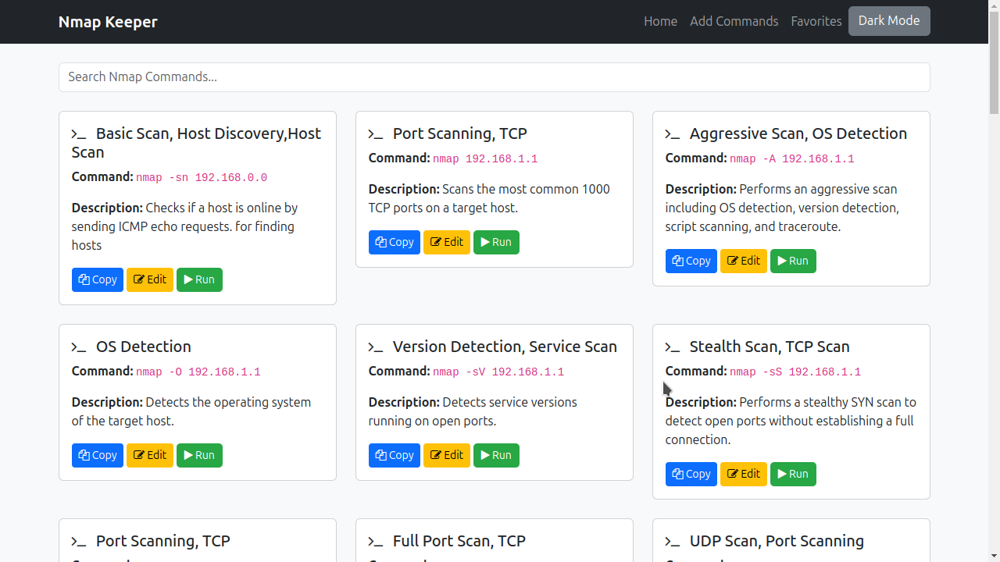
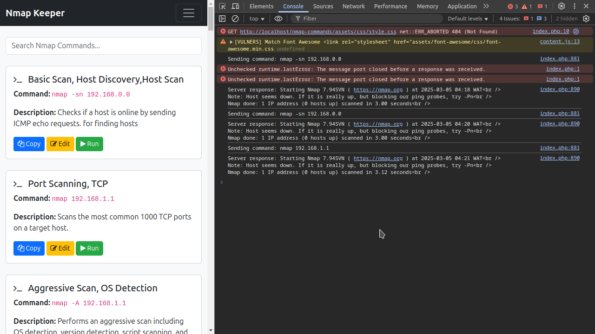
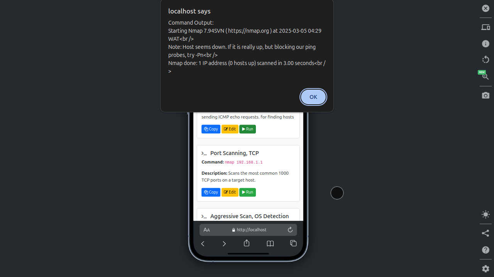
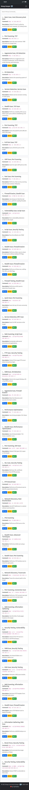
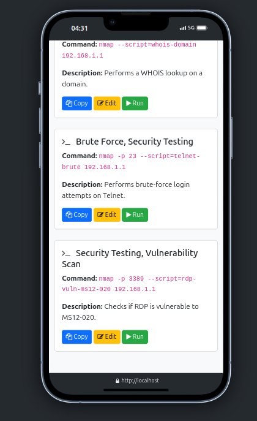
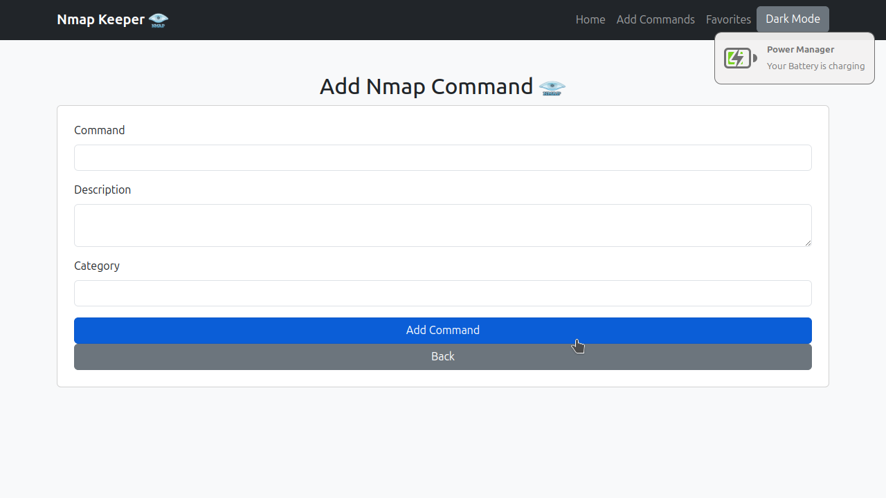

# Nmap Commands Keeper

## Overview
Nmap Commands Keeper is a lightweight web-based tool for storing, managing, and running commonly used **Nmap commands**. It allows users to:

- Store and categorize Nmap commands.
- Copy and execute commands with a single click.
- Edit and manage commands easily.
- Toggle dark mode for better UI experience.

## Features
✅ **Store and organize** Nmap commands.  
✅ **Copy commands instantly** to clipboard.  
✅ **Run commands securely** from the UI.  
✅ **Edit existing commands** via a simple modal.  
✅ **Dark mode support** for better readability.  

## Technologies Used

* PHP
* MySQL
* Bootstrap 5


## Installation
### 1. Clone the repository
```sh
git clone https://github.com/tejHacks/nmap-commands-keeper.git
cd nmap-keeper
```
### 2. Set up the database
```sql
CREATE DATABASE nmap_keeper;
```
Import the SQL schema (`nmap.sql`) into the database.

### 3. Configure the database connection
Edit the `config.php` file with your database credentials.

### 4. Start the PHP server
```sh
php -S localhost:8000
```
Open your browser and go to `http://localhost:8000`.

### 5. Use XAMPP(put the project in your htdocs folder)
```sh
sudo /opt/lampp/lampp start
```
## Usage
- Add a new command via `add_command.php`.
- Run commands directly from `index.php`.
- Edit commands using the edit button.
- View stored commands in categories.

## Security Concerns & Current Status
We **tested** the system, and it **worked** as expected. However, we encountered some security issues related to **running privileged commands** from a PHP environment. For now, we have stopped direct execution until we implement a **more secure approach**, such as:
- Running commands via a **dedicated Bash or Python script** with proper permissions.
- Restricting execution to specific, **pre-approved commands**.
- Implementing **sudoers rules** for safer execution.
- Possibly using an **API-based** approach for remote execution.

### NOTE
 **SOME COMMANDS MIGHT NOT WORK DUE TO PASSWORD ISSUE VIA TERMINAL**,I am currently working on that and aking sure it s safe but other than this, the system is safe
## Screenshots







## Contributing
Feel free to fork, submit pull requests, or suggest improvements. Your contributions help make this tool better! 🚀

## Future Enhancements

* Implement a secure command execution method.
* Add user authentication and authorization.
* Implement command search and filtering.
* Add command tagging functionality.

## License
MIT License. Free to use and modify.

---
🚀 **Built for security enthusiasts and penetration testers. Use responsibly!**

